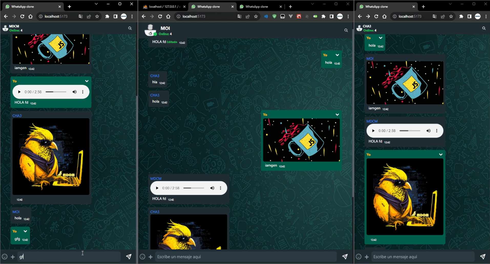

## Node, Express, Mysql, WebSocket, Tailwind css y React

Mini clone WhatsApp Web

## Frontend
- cd/frontend
- npm i
- npm run dev

## Backend
- npm i
- npm start

## import file.sql
- /database/chat_app.sql

## Tools/Herramientas

- Node.js
  - express
  - socket.io
  - Mysql
- React
- Tailwind css

- #
